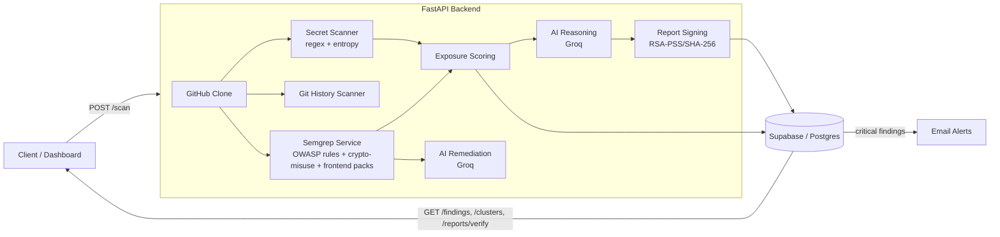

# DarkShield

DarkShield is a FastAPI backend that clones a GitHub repository, scans it for
hardcoded secrets and OWASP Top 10 vulnerability patterns, computes a
cross-repo exposure/risk score, generates an AI-assisted remediation summary,
digitally signs the resulting report, and raises email alerts on critical
findings.

It's built as a security engineering lab project spanning **ethical
hacking** (repo cloning, secret/vulnerability scanning, exposure scoring)
and **applied cryptography** (a dedicated Semgrep rule pack that detects
cryptographic misuse, plus RSA-signed scan reports for integrity
verification).

## Architecture



## Custom crypto-misuse rule pack

`security/semgrep/rules/crypto_misuse.yml` is a hand-written Semgrep rule
pack (not the registry `auto` config) covering five cryptographic-misuse
patterns, each implemented for both Python and JavaScript/TypeScript:

| Rule | Detects | OWASP | CWE |
|---|---|---|---|
| `weak-hash-md5-sha1` | `hashlib.md5()` / `hashlib.sha1()` used for hashing | A02:2021 | CWE-327 |
| `hardcoded-iv` | A literal string/bytes IV passed to `AES.new(..., MODE_CBC, ...)` | A02:2021 | CWE-329 |
| `weak-rsa-key-size` | RSA key generation with `key_size` / `modulusLength` < 2048 | A02:2021 | CWE-326 |
| `insecure-cipher-mode-ecb` | AES used in ECB mode | A02:2021 | CWE-327 |
| `insecure-random-for-security` | `random`/`Math.random()` used inside a function whose name implies a token/secret/session/password | A02:2021 | CWE-338 |

The pack runs automatically on every scan — `runner.py` merges it into the
Semgrep invocation as an additional `--config` alongside the registry-based
`auto` ruleset (see `CUSTOM_RULE_PATHS` in `security/semgrep/constants.py`),
and is unit-tested independently in `tests/test_crypto_misuse_rules.py`
(18 tests: true-positive detection + false-positive checks for both
languages, OWASP mapping, and a full pipeline integration test).

## Custom frontend-vulnerability rule pack

`security/semgrep/rules/frontend_rules.yml` targets client-side security
issues — the same mechanism as the crypto-misuse pack, a different rule set,
merged into the same scan via `CUSTOM_RULE_PATHS`:

| Rule | Detects | OWASP | CWE |
|---|---|---|---|
| `frontend-dom-xss-innerhtml` | `el.innerHTML = data` / `document.write(data)` with non-constant data | A03:2021 | CWE-79 |
| `frontend-react-dangerously-set-innerhtml` | React `dangerouslySetInnerHTML={{__html: ...}}` | A03:2021 | CWE-79 |
| `frontend-insecure-storage-of-token` | `localStorage`/`sessionStorage.setItem` with a token/auth/password/secret/apiKey key | A02:2021 | CWE-922 |
| `frontend-cors-wildcard-with-credentials` | FastAPI `CORSMiddleware` with `allow_origins=["*"]` and `allow_credentials=True` together | A05:2021 | CWE-942 |
| `frontend-target-blank-missing-noopener` | `<a target="_blank">` without `rel="noopener noreferrer"` (reverse tabnabbing) | A05:2021 | CWE-1022 |

A deliberately vulnerable demo component lives at
`security/semgrep/vulnerable_frontend_demo/XSSDemo.jsx` — it is **not** part
of the application; it exists only so a live `/scan` demo has something
guaranteed to trip `dangerouslySetInnerHTML` and insecure-storage findings
on command. Tested in `tests/test_frontend_rules.py` (17 tests, including
one that scans the demo file itself and asserts it fires).

A postMessage-missing-origin-check rule was prototyped but dropped: its
`pattern-not` shape only excluded one specific "wrap the rest of the handler
in an `if (origin === X) {...}`" structure, and false-positived on the
equally common early-return guard-clause style (`if (origin !== X) return;`).
Rather than ship a rule that flags secure code, it was cut — see "Known
limitations" below.

## AI-powered remediation suggestions

`ai/remediation.py` asks Groq for a corrected snippet + one-line rationale
for a single finding. `main.py` calls it during `/scan`, but only on a
**bounded top-10 subset** of CRITICAL/HIGH-severity **Semgrep** findings —
two deliberate scope limits worth calling out:

- **Semgrep findings only, never raw secret findings.** A secret-scanner
  finding's `snippet` field can contain the live secret value itself;
  sending that to a third-party AI API would be a real exposure. There's
  also no interesting "fix" for a leaked secret beyond "rotate it," which
  doesn't need an AI call.
- **Capped at 10 findings per scan.** These are sequential, blocking Groq
  calls (same style as the existing `build_reasoning` repo-level summary).
  Uncapped, a large repo with hundreds of findings would make the `/scan`
  request extremely slow. Parallelizing with `asyncio.gather` is a
  reasonable next step, not required for a lab-scale demo.

Each finding that gets a suggestion has it stored as `ai_suggested_fix`
(new `findings` table column, see below). Every finding still has the
existing generic `recommendation` field as a fallback — if Groq isn't
configured, the call fails, or the finding wasn't in the top 10,
`ai_suggested_fix` is simply absent/`null` and `recommendation` is what's
shown. Tested offline in `tests/test_remediation.py` (9 tests, using a
fake Groq client so no real API calls are made) covering: no-client and
empty-snippet guard clauses, API-failure fallback, prompt content, and
`<thinking>` tag stripping (reusing the same helper as `ai/reasoning.py`).

## Registering a repo for scanning

Every other endpoint (`/scan`, `/findings/{id}`, `/repos/{id}/score`,
`DELETE /repos/{id}`) assumes a `repos` row already exists. **`POST /repos`**
is the missing first step: it takes `{"github_url": "..."}`, validates it
against the same URL allowlist used before cloning
(`security/github_clone.py`'s `parse_github_url`, shared with
`clone_repository`), and creates the row.

- Idempotent: registering the same `github_url` twice returns the existing
  row (`"created": false`) instead of creating a duplicate.
- Normalizes the URL first (strips a trailing `.git` and/or `/`), so
  `.../hello-world`, `.../hello-world.git`, and `.../hello-world/` all
  resolve to the same repo.
- New rows start as `owner`, `name`, `github_url`, `status="pending"`,
  `finding_count=0`.
- Typical flow: `POST /repos` → take the returned `id` → `POST /scan` with
  that `repo_id`.

Tested in `tests/test_github_clone.py` (10 tests for `parse_github_url`:
owner/name extraction, `.git`/trailing-slash normalization, rejecting
non-GitHub/non-https/malformed/injection-style URLs) and
`tests/test_create_repo.py` (5 tests against the endpoint itself, using a
fake Supabase client: rejects malformed and injection-style URLs, inserts
a new row, is idempotent for an already-registered URL, normalizes
`.git`/trailing slash).

## Security score & OWASP context endpoints

Two small, previously-unused pieces of existing logic are now actually
exposed:

- **`GET /repos/{repo_id}/score`** — computes a 0-100 security score for a
  repo from its stored findings, using the same formula already implemented
  in `SemgrepService.calculate_security_score` (start at 100; subtract 15
  per CRITICAL, 8 per HIGH, 4 per MEDIUM, 2 per LOW; floor at 0). The
  arithmetic is duplicated directly against the `findings` table rather
  than reconstructing a full `SemgrepAnalysisResult` object, since that
  object expects the raw Semgrep finding list, not stored DB rows — three
  lines of duplicated arithmetic is simpler than reverse-engineering one.
  Returns `{"repo_id", "security_score", "breakdown": {"CRITICAL", "HIGH",
  "MEDIUM", "LOW"}}`.
- **`POST /scan`** response now includes `owasp_context` — the RAG-retrieved
  OWASP Top-10 guidance for whatever categories were found in that scan.
  `SemgrepService` already computed this on every run; it was simply being
  discarded before reaching the response.

Tested in `tests/test_security_score.py` (5 tests, using a small fake
Supabase client so no live DB connection is needed): a clean repo scores
100, severity-weighted deductions match the formula exactly, a repo with
many CRITICAL findings floors at 0 rather than going negative, an
unrecognized/missing severity value doesn't crash the endpoint, and an
unknown `repo_id` returns 404.

## Signed scan reports

Every `/scan` run produces a small, deterministic **report summary**
(repo id, owner/name, total findings, critical count, timestamp) and signs
it with an RSA-2048 keypair using **RSA-PSS/SHA-256** — real digital-signature
integrity verification, not a checksum:

- **`core/keys.py`** — loads DarkShield's report-signing keypair from
  `backend/.keys/report_signing_key.pem`, generating one on first run and
  reusing it on every subsequent run. This key signs report summaries only;
  it is unrelated to `core/crypto.py`'s Fernet cipher (which encrypts
  snippet values at rest) or the HMAC pepper (which fingerprints secrets).
  `.keys/` is gitignored — the private key never gets committed.
- **`security/report_signing.py`** — `sign_report()` / `verify_report()`.
  The report dict is serialized deterministically (`json.dumps(...,
  sort_keys=True, separators=(",", ":"))`) before signing, so verification
  doesn't depend on key insertion order matching between the original scan
  and whatever later reconstructs the payload (e.g. from a DB row).
- **`POST /scan`** response now includes `report_payload` (the exact dict
  that was signed) and `report_signature` (hex-encoded RSA-PSS signature).
  Both are also persisted to a new `scan_reports` table (best-effort — a
  failure to write to this table does not fail the scan itself, since the
  signature is already returned to the caller).
- **`POST /reports/verify`** — takes `{"report": {...}, "signature": "..."}`
  and returns `{"valid": true|false}`. Flipping even a single character in
  the report (e.g. changing `critical_findings` after the fact) flips this
  to `false`.
- **`GET /reports/public-key`** — returns the signing public key as a PEM
  string, so a signature can be checked independently of this API with any
  standard RSA-PSS/SHA-256 verification tool, not only via `/reports/verify`.

Tested in `tests/test_report_signing.py` (11 tests: keypair generation and
reuse-across-restarts, canonical-byte-order independence, valid/tampered/
wrong-key signature verification, malformed-signature handling) and
`tests/test_reports_api.py` (4 tests exercising the two new endpoints
end-to-end through the FastAPI app).

## Setup

1. **Python 3.12**, then install dependencies:
   ```bash
   pip install -r requirements.txt
   pip install -r requirements-dev.txt   # for pytest
   ```
2. **Semgrep** must be on `PATH` (installed via `requirements.txt`/`pip install semgrep`).
3. Copy `.env.example` to `.env` and fill in:
   - `SUPABASE_URL`, `SUPABASE_KEY` — Supabase project credentials
   - `ENCRYPTION_KEY` — a Fernet key (`python -c "from cryptography.fernet import Fernet; print(Fernet.generate_key().decode())"`)
   - `HMAC_SECRET_KEY` — used for secret hashing
   - `GROQ_API_KEY` — for AI reasoning summaries and remediation suggestions
   - `GITHUB_TOKEN` — optional, raises GitHub API rate limits
   - SMTP settings — for critical-alert emails
4. Run:
   ```bash
   uvicorn main:app --reload
   ```
   On first run this also generates `backend/.keys/report_signing_key.pem`
   (report-signing RSA keypair) if it doesn't already exist.
5. Open `http://127.0.0.1:8000/docs` for the interactive Swagger UI.

## API endpoints

| Method | Path | Description |
|---|---|---|
| GET | `/health` | Liveness check |
| POST | `/repos` | Register a GitHub repo for scanning (idempotent) - returns a `repo_id` for use with `/scan` |
| POST | `/scan` | Clone a GitHub repo, run secret + git-history + Semgrep scans, compute exposure score, generate AI remediation + reasoning, sign the report, store findings, email alert on critical results |
| GET | `/findings/{repo_id}` | List findings for a scanned repo |
| GET | `/repos/{repo_id}/score` | Compute a repo's current security score (0-100) and severity breakdown |
| GET | `/clusters` | Cross-repo secret clusters (same secret reused across repos) |
| DELETE | `/repos/{repo_id}` | Remove a repo and its findings |
| POST | `/reports/verify` | Verify a `{report, signature}` pair against DarkShield's signing key |
| GET | `/reports/public-key` | Fetch DarkShield's report-signing public key (PEM) |

## Known limitations / future work

- No auth on the API — anyone with the URL can trigger a scan. An API-key
  middleware on `/scan` and `/repos/*` is a natural next step.
- No retry/backoff on GitHub API calls; a single rate-limit response can
  silently lose data.
- No drift/regression detection between scans of the same repo yet.
- `security/semgrep/rules/` currently has two packs (`crypto_misuse.yml`,
  `frontend_rules.yml`); the mechanism (`CUSTOM_RULE_PATHS`) supports adding
  more without touching `runner.py` again.
- A postMessage-origin-check frontend rule was attempted and dropped for
  false-positiving on a common secure coding style; see the frontend rule
  pack section above.
- `ai_suggested_fix` is only populated for the top 10 CRITICAL/HIGH Semgrep
  findings per scan (see "AI-powered remediation suggestions" above), not
  every finding. The Groq calls are sequential/blocking; parallelizing them
  is a reasonable next step for repos with many findings.
- The signed report payload (see "Signed scan reports") is a summary, not
  the full findings list — this keeps the canonical bytes small and stable.
  A future iteration could sign a hash of the full findings set as well.
- Secret detection is pattern + entropy based only — it doesn't verify
  whether a found credential is actually live (e.g. calling the GitHub API
  with a found token) so results include both real and defunct secrets.

## Database schema note

If your Supabase project predates a given phase, run the matching migration:

```sql
-- Phase 2: entropy-based detection metadata
alter table findings add column if not exists detection_method text default 'pattern';
alter table findings add column if not exists entropy_score numeric;

-- Phase 3: git history scanning
alter table findings add column if not exists found_in text default 'current';
alter table findings add column if not exists commit_hash text;

-- Phase 6: AI remediation suggestions
alter table findings add column if not exists ai_suggested_fix text;

-- Phase 7: signed scan reports
alter table repos add column if not exists report_signature text;

create table if not exists scan_reports (
  id uuid primary key default gen_random_uuid(),
  repo_id uuid references repos(id),
  report_payload jsonb not null,
  signature text not null,
  created_at timestamptz default now()
);
```

## Final end-to-end validation (Phase 9)

Confirmed clean on a fresh checkout:

- Fresh `pip install -r requirements.txt` + `.env` copied from `.env.example` → `uvicorn main:app --reload` starts clean, generating `backend/.keys/report_signing_key.pem` on first run.
- `pytest` → **105/105 passing** (a stale demo-file path in `tests/test_frontend_rules.py` from an earlier phase was found and fixed during this pass).
- `GET /health` → `200 {"status": "ok"}`.
- Every route has a Swagger `summary` and a return type hint, so `/docs` renders a complete, presentable interactive schema.
- `POST /scan` against a repo containing a mix of secrets, crypto-misuse, and frontend findings returns: pattern + entropy secret findings, history-only findings (`found_in="history"`), Semgrep findings mapped to OWASP categories, `ai_reasoning`, `ai_suggested_fix` on the top 10 CRITICAL/HIGH findings, `owasp_context`, `report_payload`, and `report_signature`.
- `POST /reports/verify` accepts a valid `{report, signature}` pair and rejects one with a single tampered character.
- `GET /repos/{repo_id}/score`, `GET /findings/{repo_id}`, and `GET /clusters` all return sane, well-typed data.

## Tests

```bash
pytest
```

120 tests covering core crypto helpers, exposure scoring, the secret
scanner, entropy-based detection, git history scanning, GitHub URL
validation/parsing and repo registration, the Semgrep pipeline (including
the OWASP-registry rules), the custom crypto-misuse rule pack, the custom
frontend-vulnerability rule pack, the AI remediation module, RSA report
signing/verification, the `/reports/*` API endpoints, and the
`/repos/{repo_id}/score` endpoint — all described above.